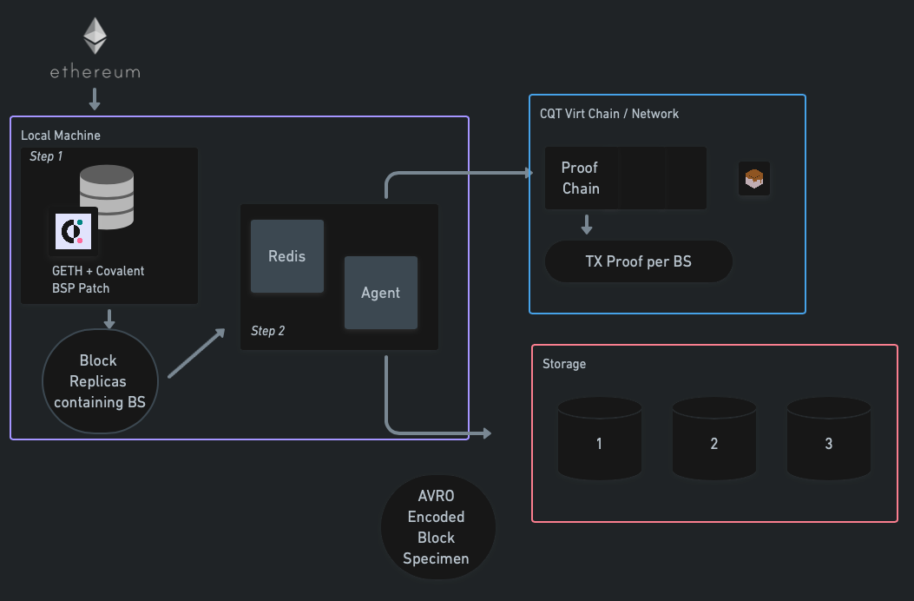

# BSP-agent (mq-store-agent)

Reads block-replicas (block-results, block-specimens, or any other types) produced by geth block specimen/result producers streamed into a redis stream, decodes them from RLP encoding, creates a proof transaction on a virtual chain with a sha-256 checksum of the data in the object, and persists them into object storage for a specified google bucket and saves it to a file - atomically.

Please refer to these internal [instructions](https://docs.google.com/document/d/1BMC9-VXZfpB6mGczSu8ylUXJZ_CIx4ephepDtlruv_Q/edit?usp=sharing) for running the BSP with the mq-store-agent (BSP-agent).

Please refer to this internal [whitepaper](https://docs.google.com/document/d/1J6RalVVfMSh2kSKNHM3Agb4GngzWVw9e1PqLSVb3-PU/edit#) to understand more about its function.

Externally facing validator [documentation.](https://www.notion.so/covalenthq/Validator-Documentation-e9fdba94c9e149aeba798ece303dc5d4)

Externally facing workshop [deck.](https://docs.google.com/presentation/d/1qInReJcMxvVywJ8onoFPoKCwuorJ8LpOn3hwLJIl7bg/edit?usp=sharing)

## Architecture



## Block-replica

Block Replicas are created by [BSP](https://docs.google.com/document/d/1BMC9-VXZfpB6mGczSu8ylUXJZ_CIx4ephepDtlruv_Q/edit#heading=h.5owqpz3w99gp) here and fed into redis.

These objects are extracted and read into the following struct. There are three types  of objects currently
    1. Block-replicas have all the data captured shown below.
    2. Block-results have all the data shown below except "State".
    3. Block-specimens have all the data shown below except "TotalDifficulty", "Receipts"(&"Logs"), "Senders"

    ```go
        type BlockReplica struct {
            Type            string
            NetworkId       uint64
            Hash            common.Hash
            TotalDifficulty *big.Int
            Header          *Header
            Transactions    []*Transaction
            Uncles          []*Header
            Receipts        []*Receipt
            Senders         []common.Address
            State           *StateSpecimen
        }
    ```

### State-specimen

The "State" is comprised of all state information related to accounts ever touched for a given block.

    ```go
        type StateSpecimen struct {
            AccountRead []*accountRead
            StorageRead []*storageRead
            CodeRead    []*codeRead
        }

        type accountRead struct {
            Address  common.Address
            Nonce    uint64
            Balance  *big.Int
            CodeHash common.Hash
        }

        type storageRead struct {
            Account common.Address
            SlotKey common.Hash
            Value   common.Hash
        }

        type codeRead struct {
            Hash common.Hash
            Code []byte
        }
    ```

## Environment

The Eth private key allows the validator to make proof transactions to the proof-chain contract and is required.
Other env vars are optional depending on your redis, eth account configuration.

    ```env
        ETH_PRIVATE_KEY=private/key/senders #required
        REDIS_PWD=your-redis-password #optional
        ETH_KEYSTORE_PATH=path/to/keystore/file.json #optional
        ETH_KEYSTORE_PWD=password/to/access/keystore/file.json #optional
    ```
Please `brew install direnv` add the following to you bash -

    ```bash
    # bash users - add the following line to your ~/.bashrc
    eval "$(direnv hook bash)"
    # zsh users - add the following line to your ~/.zshrc
    eval "$(direnv hook zsh)"
    ```

And enable the vars with `direnv allow .`
For which you should see something like -

    ```shell
        direnv: loading ~/Documents/covalent/mq-store-agent/.envrc
        direnv: export +ETH_PRIVATE_KEY
    ```

## Build & Run

Run the agent directly with the following -

    ```bash
    go run ./cmd/mqstoreagent/*.go \ 
        --redis-url="redis://username:@localhost:6379/0?topic=replication#replicate" \ 
        --codec-path="./codec/block-replica.avsc" \ 
        --binary-file-path="./bin/block-replica/" \ 
        --gcp-svc-account="/Users/pranay/.config/gcloud/bsp-2.json" \ 
        --replica-bucket="covalenthq-geth-block-specimen" \ 
        --segment-length=5 \ 
        --eth-client="http://127.0.0.1:7545" \ 
        --proof-chain-address="0xb5B12cbe8bABAF96677F60f65317b81709062C47"
    ```
or update the Makefile with the correct --gcp-svc-account, --replica-bucket & --proof-chain-address
and run the following.

    ```bash
        make run-build
        make run-agent
    ```

## Inspect

To view pretty print the results from the creation of avro encoded block-replica files

    ```bash
    go run extractor.go \ 
        --binary-file-path="../bin/block-replica/" \ 
        --codec-path="../codec/block-replica.avsc" \ 
        --indent-json=0
    ```

Please make sure that the --binary-file-path and --codec-path matches the ones given while running the agent.
--indent-json (0,1,2)can be used to pretty print the AVRO json objects.
